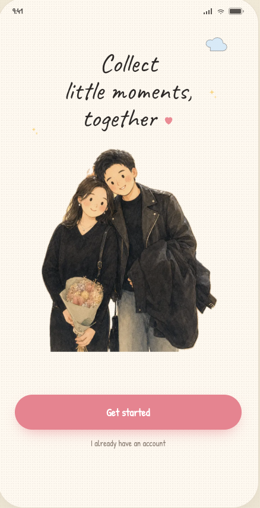
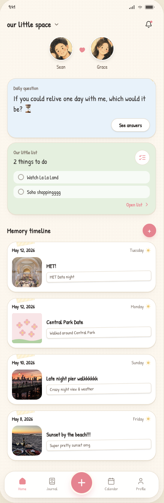
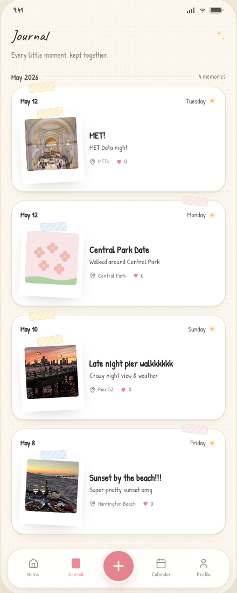
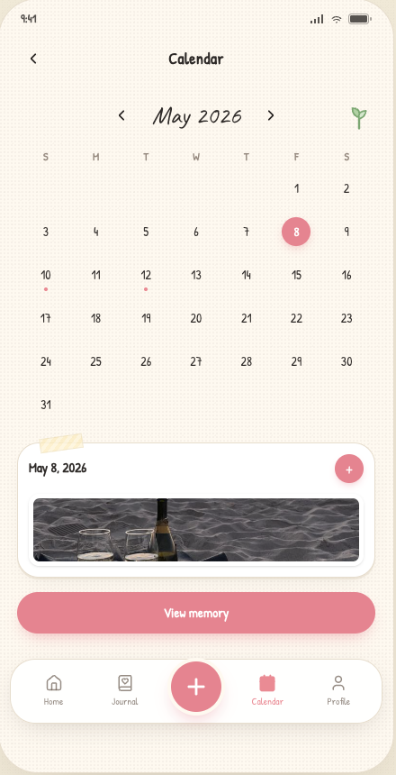
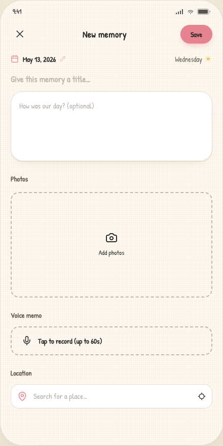
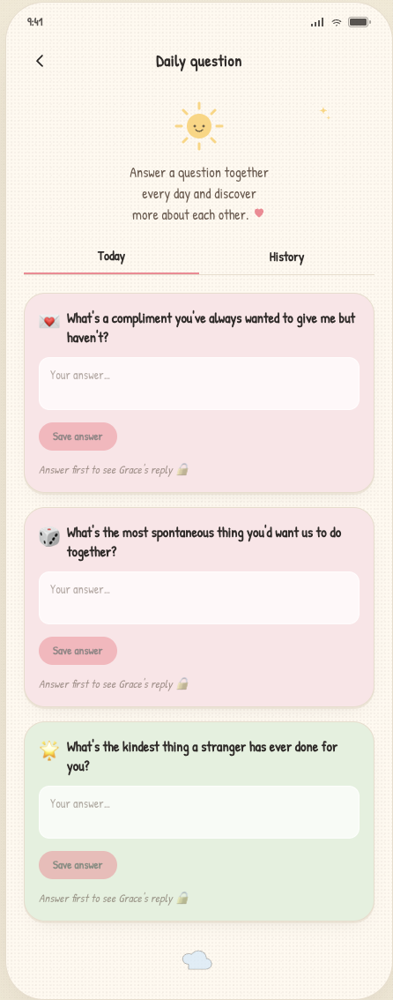
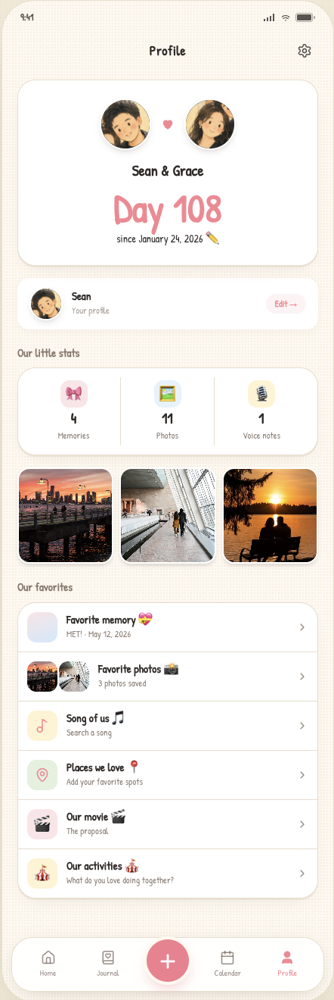
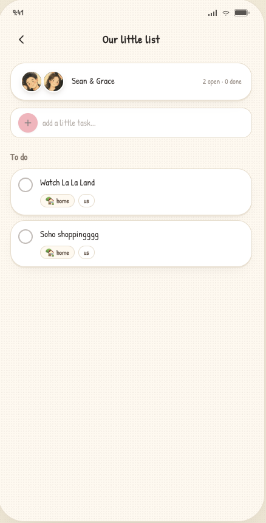

# Scrapbook

A couples' memory-keeping app built with React Native (Expo) and Convex. Capture shared memories, answer daily questions together, plan dates, and build a private scrapbook with your partner.

## Screenshots

| Landing | Home | Journal | Calendar |
|---|---|---|---|
|  |  |  |  |

| New Memory | Daily Questions | Profile | Todo |
|---|---|---|---|
|  |  |  |  |

## Features

- **Shared memories** — create journal entries with photos, voice memos, and location tags
- **Daily questions** — answer a fresh prompt each day and see your partner's answer
- **Shared todos** — a couples' checklist with categories (date, trip, errand, etc.)
- **Calendar view** — browse memories by date with a dot-per-day indicator
- **Profile & favorites** — track your anniversary, favorite memory, song, places, and more
- **Invite system** — join a partner's space via a 6-character code or shared link
- **Reactions & comments** — heart and comment on each other's memories and photos

## Tech stack

- **React Native** via [Expo](https://expo.dev) (SDK 54) with Expo Router (file-based routing)
- **Backend** — [Convex](https://convex.dev) (real-time queries, mutations, file storage)
- **Auth** — [`@convex-dev/auth`](https://github.com/get-convex/convex-auth) (email/password)
- **Styling** — NativeWind (Tailwind for RN) + custom design tokens
- **Icons** — `lucide-react-native`

## Getting started

### Prerequisites

- Node.js 18+
- Expo CLI (`npm install -g expo-cli`)
- A [Convex](https://dashboard.convex.dev) account

### Install

```bash
npm install
```

### Set up Convex

```bash
npx convex dev
```

This will prompt you to log in and link/create a Convex project, then start the dev backend and sync your schema.

### Environment variables

Create `.env.local` with the values printed by `npx convex dev`:

```
EXPO_PUBLIC_CONVEX_URL=https://<your-deployment>.convex.cloud
```

### Run

```bash
# Expo Go / development build
npm start

# iOS simulator
npm run ios

# Android emulator
npm run android
```

## Project structure

```
app/                  # Expo Router screens
  (auth)/             # Sign-in / sign-up
  (tabs)/             # Bottom tab screens (home, journal, calendar, profile)
  onboarding/         # Profile setup + invite partner flow
  memory/[id]/        # Memory detail + edit
  new.tsx             # Create memory
  daily-question.tsx  # Daily question screen
  todos.tsx           # Shared todo list
  settings.tsx        # Account settings
  invite/[code]/      # Accept partner invite

convex/               # Backend functions and schema
  schema.ts           # Database schema
  memories.ts         # Memory CRUD
  users.ts            # User profile
  spaces.ts           # Shared space (couple)
  invites.ts          # Invite code flow
  todos.ts            # Shared todos
  dailyQuestions.ts   # Daily question pool + answers
  reactions.ts        # Heart reactions
  comments.ts         # Memory comments
  favorites.ts        # Space favorites (song, places, etc.)

components/ui/        # Shared UI components
theme/                # Color palette and shadow tokens
constants/            # Avatar presets, category definitions
```

## Running tests

```bash
npm test
```

## Design

The app uses a warm, handmade aesthetic — cream backgrounds, coral accents, polaroid-style photos with tape strips, and handwritten fonts (Patrick Hand, Caveat, Gaegu). See [`DESIGN.md`](DESIGN.md) for the full design system reference.
